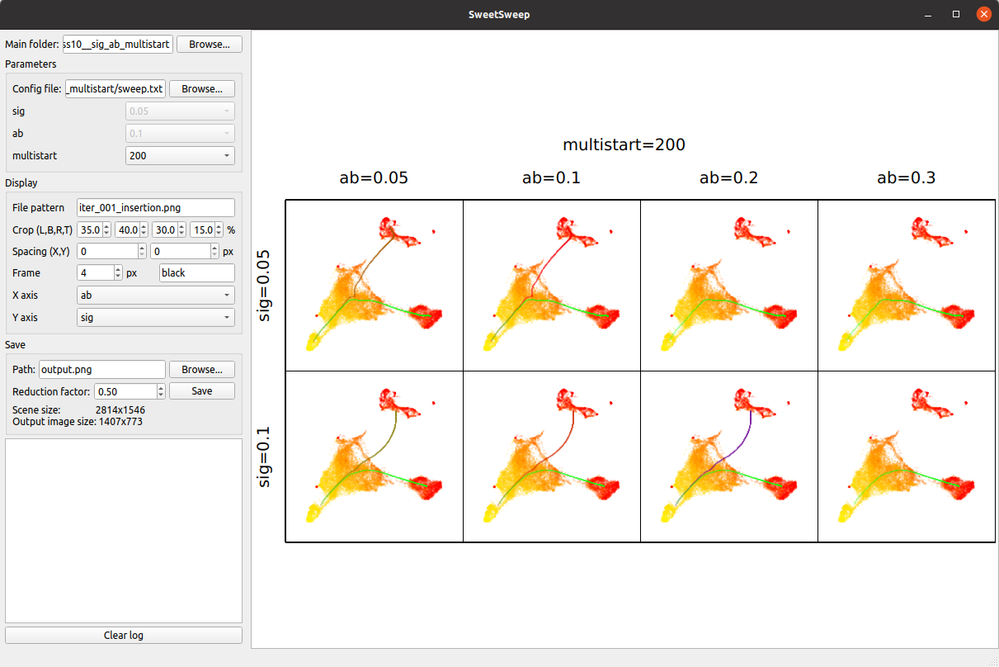

# SweetSweep
A sweet app to quickly visualize results from parameter sweeps.
Also comes with functions to run the sweeps and avoid the boilerplate code that comes with them.



### Installation

From [PyPI](https://pypi.org/project/sweetsweep/):
```bash
pip install sweetsweep
```

### Overview

This app provides two things:
- functions to run parameter sweeps
- a viewer app to explore the results of the sweep

Note that you can use the viewer for sweep results that have not been generated
by the functions of this package. The results just need to be in a particular (easy) format.
More details below.

### Run parameter sweeps

This package has a function that does the parameter sweep for you and takes care of creating all the
directories with the correct names, so that you can directly use the viewer once the sweep is done.
It's as simple as this:
```python
import sweetsweep

# 'param_sweep' is a dictionary of parameter values to sweep over
# 'my_experiment' is the function doing one experiment
# 'my_sweep_dir' is the folder in which to save the results of the sweep
sweetsweep.parameter_sweep(param_sweep, my_experiment, my_sweep_dir)
```
You can also run the sweep in parallel using `sweetsweep.parameter_sweep_parallel()`

Take a look at the examples on how to use this function in `examples`. To try one out, simply do:
```bash
  python3 examples/example.py      # Runs the example parameter sweep
  python -m sweetsweep results/    # Launch the viewer to visualize the results
```

### Viewer

This app allows you to:
- quickly visualize image results (e.g. plots, graphs, etc), and easily switch between
combinations of parameter values
- visualize grids of the results with varying parameters in the X and Y axis
- overlay scalar results on the grid of image results (e.g. running time)
- save those visualizations to file
- take notes on your results and have them saved automatically

To run it, simply do:
```bash
  python -m sweetsweep [results_dir]
```
You can specify the results directory to avoid entering it manually in the app.


### Format of the results folder

You can use this app if the output folders of your parameter sweep are
named using their respective parameter values, like so:
```
$ ls results/
exp_00__alpha5_beta0.1_gammaRed/
exp_01__alpha5_beta0.1_gammaBlue/
exp_02__alpha5_beta0.2_gammaRed/
exp_03__alpha5_beta0.2_gammaBlue/
exp_04__alpha5_beta0.5_gammaRed/
exp_05__alpha5_beta0.5_gammaBlue/
exp_06__alpha10_beta0.1_gammaRed/
exp_07__alpha10_beta0.1_gammaBlue/
exp_08__alpha10_beta0.2_gammaRed/
exp_09__alpha10_beta0.2_gammaBlue/
exp_10__alpha10_beta0.5_gammaRed/
exp_11__alpha10_beta0.5_gammaBlue/
exp_12__alpha15_beta0.1_gammaRed/
exp_13__alpha15_beta0.1_gammaBlue/
exp_14__alpha15_beta0.2_gammaRed/
exp_15__alpha15_beta0.2_gammaBlue/
exp_16__alpha15_beta0.5_gammaRed/
exp_17__alpha15_beta0.5_gammaBlue/
sweep.txt
```

You just need to add a configuration file `sweep.txt` to your folder,
that describes each parameter and its values, in a JSON format:
```
$ cat results/sweep.txt
{
"alpha": [5, 10, 15],
"beta": [0.1, 0.2, 0.5],
"gamma": ["Red", "Blue"]
}
```
Let's say that each directory contains a file `image.png`,
and you want to compare the results in this file depending on the parameters.


### Config file

- You can input the config file path manually, or if there is a `sweep.txt`
  file in the main folder, it will be loaded automatically.
- The parameter values don't have to be numerical, they can be anything as
  long as their `str()` representation is unique: `bool, int, str`, etc.
- You can also add meta parameters that are the viewer's parameters, and
  the application will load these values directly
  - `viewer_cropLBRT`: cropping images (LBRT: Left,Bottom,Right,Top).

    e.g.: `"viewer_cropLBRT": [35,40,30,15],`
  - `viewer_filePattern`: text for the file pattern textbox. You can also pass
  a list of filenames or file patterns, and it will create a combo box containing
  this list so that you can quickly switch between them.

    e.g.: `"viewer_filePattern": "image.png",`
    or: `"viewer_filePattern": ["image1.png","image2.png"],`

### Distant access

The app can access mounted folders, which is great if you ran the sweep on
a server, because you don't to copy all result folders to your computer.

  - **Linux**: I only tried on Ubuntu with a folder mounted with SFTP, in which case the
  URL you need to provide is:
  `/run/user/$uid/gvfs/sftp:host=<host>,user=<user>/path/to/folder`.
  Replace `<host>` by the host name, `<user>` by your username, `$uid` by
  your user id, which you can get by running `id -u` (it is `1000` if you are the
  only user on your system), and `path/to/folder` by the path to the remote folder.
  - **Mac**: https://sftptogo.com/blog/how-to-mount-sftp-as-a-drive-on-mac/
  - **Windows**: https://sftptogo.com/blog/how-to-map-sftp-as-a-windows-10-drive/

### Miscellaneous

- You can zoom in the view with the mouse wheel, and move around with
  `Left-click + drag.`

- The file pattern supports glob patterns (using the `*` wildcard), along with
  an index selector: `image_*.png[<idx>]`. You can replace `<idx>` with a number
  that selects which match to plot. Negative indices count from the end, so
  `image_*.png[-1]` selects the last file that matches `image_*.png` in the
  folder. The matched files are in alphanumerical order. The matched pattern
  (what `*` replaces) is drawn in the top left corner of each image. This is
  useful if you have an iterative algorithm, and you want to plot the result
  of the last iteration of each folder.
